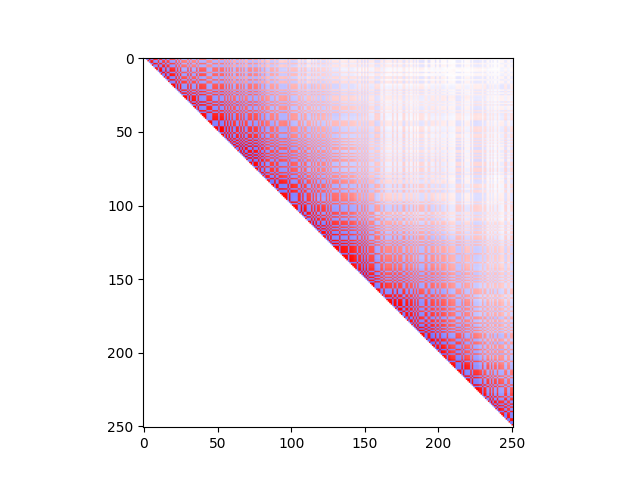

# Presentation of HaploDynamics 
**HaploDynamics** (**HaploDX**) is a Python 3+ library that provides a collection of functions for simulating population-specific genomic data. It is part of the Genetic Simulator Resources (GSR) catalog. You can access the GSR catalog by clicking on the image below.

<div style="width: 180px; margin: auto;"><a href="https://surveillance.cancer.gov/genetic-simulation-resources/"></a></div>

## Highlights and updates
Release version ```0.3b*```:

1. Module ```Framework``` has been updated:
    - Class ```Model``` added. Methods currently available:
      * [HaploDynamics.Framework.Model.\_\_init\_\_](docs/source/framework-doc.md#haplodynamicsframeworkmodel__init__) (with a tutorial)
      * [HaploDynamics.Framework.Model.initiate_vcf](docs/source/framework-doc.md#haplodynamicsframeworkmodelinitiate_vcf) (with a tutorial)
      * [HaploDynamics.Framework.Model.generate_vcf](docs/source/framework-doc.md#haplodynamicsframeworkmodelgenerate_vcf) (with tutorials and performance tests)

2. Module ```HaploDX``` has been updated:
    - A loading bar was added to the following processes, with information on time and memory:
      * [HaploDynamics.HaploDX.genmatrix](docs/source/haplodx-doc.md#haplodynamicshaplodxgenmatrix)
      * [HaploDynamics.HaploDX.create_vcfgz](docs/source/haplodx-doc.md#haplodynamicshaplodxcreate_vcfgz)
      - Example:
          ```shell
          $ python myscript.py
          genmatrix: >||||||||||||||||||||< 100%
          time (sec.): 3.409385681152344e-05
          max. mem (MB): 0.0008192062377929688
          cur. mem (MB): 0.0007524490356445312
          ```
    - The accuracy of simulations has been improved by using better genotype representations. The <a href="https://www.normalesup.org/~tuyeras/node_diss/blg/home.php?page=blg_stat/stat_1/home.php">tutorial</a> has been updated to reflect these changes. The following functions have been affected by this change:
        * [HaploDynamics.HaploDX.genotype](docs/source/haplodx-doc.md#haplodynamicshaplodxgenotype)
        * [HaploDynamics.HaploDX.gref](docs/source/haplodx-doc.md#haplodynamicshaplodxgref)
        * [HaploDynamics.HaploDX.cond_genotype_schema](docs/source/haplodx-doc.md#haplodynamicshaplodxcond_genotype_schema)
        * [HaploDynamics.HaploDX.continue_block](docs/source/haplodx-doc.md#haplodynamicshaplodxcontinue_block)
        * [HaploDynamics.HaploDX.minor_haplotype](docs/source/haplodx-doc.md#haplodynamicshaplodxminor_haplotype)

3. [Documentation](#documentation) completed with step-by-step instructions and visualizations. 

## Installation

### Installation via ```pip```
Install the HaploDynamics package by using the following command.
```shell
$ pip install HaploDynamics
```
After this, you can import the modules of the library to your script as follows.
```python
import HaploDynamics.HaploDX as hdx
import HaploDynamics.Framework as fmx
```
To upgrade the package to its latest version, use the following command.
```shell
$ pip install --upgrade HaploDynamics==0.3b1
```
### Manual installation
HaploDynamics uses the [SciPy](https://docs.scipy.org/doc/scipy/reference/stats.html) library for certain calculations. To install SciPy, run the following command, or see SciPy's [installation instructions](https://scipy.org/install/) for more options.
```shell
$ python -m pip install scipy
```
You can install the HaploDynamics GitHub package by using the following command in a terminal.
```shell
$ git clone https://github.com/remytuyeras/HaploDynamics.git
```
Then, use the ```pwd``` command to get the absolute path leading to the downloaded package.
```shell
$ ls
HaploDynamics
$ cd HaploDynamics/
$ pwd
absolute/path/to/HaploDynamics
```
To import the modules of the library to your script, you can use the following syntax where the path ```absolute/path/to/HaploDynamics``` should be replaced with the path obtained earlier.
```python
import sys
sys.path.insert(0,"absolute/path/to/HaploDynamics")
import HaploDynamics.HaploDX as hdx
import HaploDynamics.Framework as fmx
```
## Quickstart

The following script generates a VCF file containing simulated diploid genotypes for a population of 1000 individuals with LD-blocks of length 20kb, 5kb, 20kb, 35kb, 30kb and 15kb. 
```python
import HaploDynamics.HaploDX as hdx

simulated_data = hdx.genmatrix([20,5,20,35,30,15],strength=1,population=0.1,Npop=1000)
hdx.create_vcfgz("genomic-data.simulation.v1",*simulated_data)
```
The equation ```strength=1``` forces a high amount of linkage disequilibrium and the equation ```population=0.1``` increases the likelyhood of the simulated population to have rare mutations (e.g. to simulate a population profile close to African and South-Asian populations). 

More generally, the function ```genmatrix()``` takes the following types of parameters:
Parameters | Type | Values
| :--- | :--- | :---
```blocks```  | ```list[int]``` | List of positive integers, ideally between 1 and 40.
```strength```  | ```float``` | From -1 (little linkage) to 1 (high linkage)
```population```  | ```float``` | From 0 (for more rare mutations) to 1 (for less rare mutations)
```Npop```  | ```int```  | Positive integer specifying the number of individuals in the genomic matrix

The generation of each locus in a VCF file tends to be linear in the parameter ```Npop```. On average, a genetic variant can take from 0.3 to 1 seconds to be generated when ```Npop=100000``` (this may vary depending on your machine). The estimated time complexity for an average machine is shown below.

 

## Use cases
The following script shows how to display linkage disequilibirum correlations for the simulated data.
```python
import matplotlib.pyplot as plt
import HaploDynamics.HaploDX as hdx

simulated_data = hdx.genmatrix([20,20,20,20,20,20],strength=1,population=0.1,Npop=1000)
hdx.create_vcfgz("genomic-data.simulation.v1",*simulated_data)

rel, m, _ = hdx.LD_corr_matrix(simulated_data[0])
plt.imshow(hdx.display(rel,m))
plt.show()
```
A typical output for the previous script should look as follows.

 

The following script shows how you can control linkage disequilibrium by using LD-blocks of varying legnths. You can display the graph relating distances between pairs of variants to average correlation scores by using the last output of the function ```LD_corr_matrix()```.

```python
import matplotlib.pyplot as plt
import HaploDynamics.HaploDX as hdx

ld_blocks = [5,5,5,10,20,5,5,5,5,5,5,1,1,1,2,2,10,20,40]
strength=1
population=0.1
Npop = 1000
simulated_data = hdx.genmatrix(ld_blocks,strength,population,Npop)
hdx.create_vcfgz("genomic-data.simulation.v1",*simulated_data)

#Correlations
rel, m, dist = hdx.LD_corr_matrix(simulated_data[0])
plt.imshow(hdx.display(rel,m))
plt.show()

#from genetic distances to average correlaions
plt.plot([i for i in range(len(dist)-1)],dist[1:])
plt.ylim([0, 1])
plt.show()
```
Typical outputs for the previous script should look as follows.

Correlations            |  genetic distances to average correlations
:-------------------------:|:-------------------------:
  |  

Finally, the following script shows how you can generate large regions of linkage.

```python
import matplotlib.pyplot as plt
import HaploDynamics.HaploDX as hdx

ld_blocks = [1] * 250
strength=1
population=0.1
Npop = 1000
simulated_data = hdx.genmatrix(ld_blocks,strength,population,Npop)
hdx.create_vcfgz("genomic-data.simulation.v1",*simulated_data)

#Correlations
rel, m, dist = hdx.LD_corr_matrix(simulated_data[0])
plt.imshow(hdx.display(rel,m))
plt.show()

#from genetic distances to average correlaions
plt.plot([i for i in range(len(dist)-1)],dist[1:])
plt.ylim([0, 1])
plt.show()
```
Typical outputs for the previous script should look as follows.

Correlations            |  genetic distances to average correlations
:-------------------------:|:-------------------------:
  |  

## To cite this work

Tuyeras, R. (2023). _HaploDynamics: A python library to develop genomic data simulators_ (Version 0.3-beta.1) [Computer software]. [](https://zenodo.org/badge/latestdoi/609227235)

<br/>

# Documentation

* [Documentation for the HaploDX module](docs/source/haplodx-doc.md) 
* [Documentation for the Framework module](docs/source/framework-doc.md)
