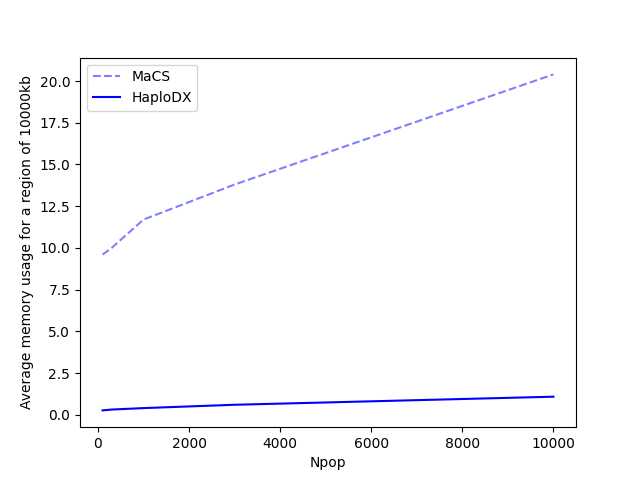
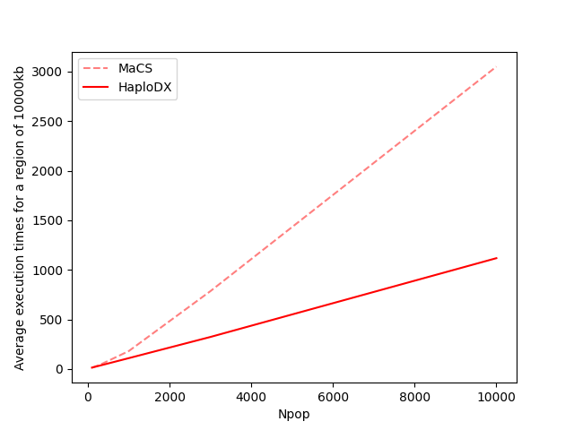

# Documentation for the  ```Framework``` module
This cloud-native module provides enhanced functionalities for software development and experimentation. It includes more efficient versions of the functions in the HaploDX module, as well as support for deployment and scaling on cloud computing platforms.

The module currently contains the following features:

* [HaploDynamics.Framework.Model](#haplodynamicsframeworkmodel)
  * [HaploDynamics.Framework.Model.\_\_init\_\_](#haplodynamicsframeworkmodel__init__)
  * [HaploDynamics.Framework.Model.initiate_landscape](#haplodynamicsframeworkmodelinitiate_landscape)
  * [HaploDynamics.Framework.Model.extend_landscape](#haplodynamicsframeworkmodelextend_landscape)
  * [HaploDynamics.Framework.Model.standard_schema](#haplodynamicsframeworkmodelstandard_schema)
  * [HaploDynamics.Framework.Model.initiate_vcf](#haplodynamicsframeworkmodelinitiate_vcf)
  * [HaploDynamics.Framework.Model.generate_vcf](#haplodynamicsframeworkmodelgenerate_vcf)

&nbsp; 

> **Warning**
> This module is currently under active development
>
* **Coming soon** [HaploDynamics.Framework.VCF](#haplodynamicsframeworkvcf2model)
  * **Coming soon** [HaploDynamics.Framework.VCF.\_\_init\_\_](#haplodynamicsframeworkvcf2model__init__)
  * **Coming soon** [HaploDynamics.Framework.VCF.\_\_add\_\_](#haplodynamicsframeworkvcf2model__add__)
  * **Coming soon** [HaploDynamics.Framework.VCF.\_\_mul\_\_](#haplodynamicsframeworkvcf2model__mul__)

&nbsp; 

---

## HaploDynamics.Framework.Model
This section describes the class ```Model```, which provides methods for modeling population-specific genomic data in variant call format (VCF). The class currently has the following methods:

* [HaploDynamics.Framework.Model.\_\_init\_\_](#haplodynamicsframeworkmodel__init__)
* [HaploDynamics.Framework.Model.initiate_landscape](#haplodynamicsframeworkmodelinitiate_landscape)
* [HaploDynamics.Framework.Model.extend_landscape](#haplodynamicsframeworkmodelextend_landscape)
* [HaploDynamics.Framework.Model.standard_schema](#haplodynamicsframeworkmodelstandard_schema)
* [HaploDynamics.Framework.Model.initiate_vcf](#haplodynamicsframeworkmodelinitiate_vcf)
* [HaploDynamics.Framework.Model.generate_vcf](#haplodynamicsframeworkmodelgenerate_vcf)


A description of the class variables is given in the description of the initializer method ```__init__()```.

&nbsp; 

### HaploDynamics.Framework.Model.\_\_init\_\_

The initializer method for the class initializes ```Model``` instances along with 5 variables:

Variable | Description
 :------- | :-------------------------
```self.pool``` | a ```Pool``` object from the module [multiprocessing](https://docs.python.org/3/library/multiprocessing.html) of the **Python Standard Library**.
```self.fname``` | a string representing a name of reference for the files generated with the methods of the class.
```self.eol``` | a string containing the _end of line character_ for the ambient OS.
```self.initial_schema``` | a pair $(f,r)$, where $f$ is a stochastic process $[0,1] \to [0,1]$ that takes a bottleneck parameter $\alpha \in [0,1]$ and returns an allele frequency stochastic process genetic position and $r$ is a genetic position. See the method [initialize_landscape](#haplodynamicsframeworkmodelextend_landscape) for more information.
```self.landscape``` | a list of triples defining genomic region profiles called _genetic schemas_. See the method [extend_landscape](#haplodynamicsframeworkmodelextend_landscape) for the definition of a schema.


&nbsp; 

####  **Presentation**
```python
def __init__(self,
             fname: str,
             cpus: int = 1,
             system: str = "unix"
             ) -> None
```
 <ins>Description</ins>

 - **inputs:**
    - ```fname```: a string representing a name of reference for the files generated with the methods of the class. For example, the string is used to name the output VCF file for the simulated data generated by the method ```generate_vcf()```.
    - ```cpus```: number of cpus to be used by the generative processes associated with the class instance. This feature is currently under developement cannot take other values other than ```1```;
   - ```system```: a string that is either equal to ```"unix"``` or any other string. If the string is equal to ```"unix"```, then every end of line of the VCF file is formatted according to unix systems (i.e using the character ```\n```). Otherwise, the end of line is formatted according to windows systems (i.e using the character ```\r\n```).

 - **variables:**
    - ```self.pool```: initialized as the ```Pool``` object returned by ```multiprocessing.Pool(cpus)```;
    - ```self.fname```: initialized as ```fname```;
    - ```self.eol```: initialized to the string ```"\n"``` if the input ```system``` contains the string ```"unix"```. Otherwise it is initialized to the string ```"\r\n"``` to be compatible with _Windows_ OS systems;
    - ```self.initial_schema```: initialized by calling the process ```self.initialize_landscape()```
    - ```self.landscape```: initialized to an empty list.


&nbsp; 

####  **Tutorial**
The following code snippet shows how to initialize an instance of the class ```Model```.
```python
import HaploDynamics.Framework as fmx

model = fmx.Model("tutorial")
```

&nbsp; 

### HaploDynamics.Framework.Model.initiate_landscape

The method ```initiate_landscape()``` can be used to define the first genetic position to be included in a simulation of variant call data. Specifically, it initializes the variable ```self.initial_schema``` with a pair $(f,r)$, where:
  - $f$ is a stochastic process $[0,1] \to [0,1]$ that takes a bottleneck parameter $\alpha \in [0,1]$ and returns an allele frequency stochastic process genetic position; and 
  - $r$ is a genetic position.

> **Note**
> The variable contains a simplified encoding of a genetic schema as defined in [extend_landscape](#haplodynamicsframeworkmodelextend_landscape). Specifically, if the variable ```self.initial_schema``` contains a pair $(f,r)$, then the associated genetic schema is defined by the triple $(1,f,g)$ where $g$ is the constant function $s\mapsto [r]$.

&nbsp; 

####  **Presentation**
```python
def initiate_landscape(self,
                     afs: Callable[[float],float] = afs_sample,
                     reference: float = 0
                     ) -> None
```
 <ins>Description</ins>

 - **inputs:**
    - ```afs```: a stochastic process $[0,1] \to [0,1]$ that takes a bottleneck parameter $\alpha \in [0,1]$ and returns an allele frequency;
    - ```reference```: a floating-point number that represents a genetic position.
    
      > **Note**
      > The genetic position ```reference``` is used as the least genetic position to index the dataset simulated by the process ```generate_vcf()```. Specifically, this genetic position is prepended to the list of genetic positions generated by the genetic schemas contained in the list ```self.landscape```. This means that the VCf file generated by the process ```generate_vcf()``` contains ```sum([npos for npos,_,_ in self.landscape])+1``` genetic positions;
      >


&nbsp; 

####  **Tutorial**
The following code snippet shows how to call and use the method ```standard_schema```.
```python
import HaploDynamics.Framework as fmx

model = fmx.Model("tutorial")

model.initiate_landscape(reference = 1.245)

print(f"The first genetic position of our simulation is at {1000*model.initial_schema[1]}k")
```
The execution of the previous script should produce the following output.
```shell
$ python3 myscript.py
The first genetic position of our simulation is at 1245.0k
```

&nbsp; 


### HaploDynamics.Framework.Model.extend_landscape

The method ```extend_landscape()``` extends the list stored in the variable ```self.landscape``` with the sequence of items passed in the input. By convention, this sequence must only contain **genetic schemas**, which are defined below.


**Definition (genetic schema).** A _genetic schema_ is defined as a triple $(b,f,g)$, where:
  - $b$ is a number of genetic positions in an LD block;  
  - $f$ is a stochastic process $[0,1] \to [0,1]$ that takes a bottleneck parameter $\alpha \in [0,1]$ and returns an allele frequency;
  - $g$ is a stochastic process $\mathbb{R} \to \mathbb{R}^N$ that takes an input value and returns a sequence of $N$ successive genetic positions, all greater than the input value.

The previous collection of items can be seen as a specification for a genetic region, where $g$ specifies variant positions in the region and $f$ specifies a mutation rate profile for these positions.


&nbsp; 

####  **Presentation**
```python
SchemaType = tuple[int,Callable[[float],float],Callable[[float],list[float]]]

def extend_landscape(self,
                     *schemas: SchemaType
                     ) -> int
```
 <ins>Description</ins>

 - **inputs:**
    - ```schemas```: a sequence of genetic schemas, as defined above in the introduction.
 - **output:**
    - an integer value equal to the legnth of the list contained in ```self.landscape```.


&nbsp; 

####  **Tutorial**
The following code snippet shows how to call and use the method ```standard_schema```.
```python
import HaploDynamics.Framework as fmx

model = fmx.Model("tutorial")

n = model.extend_landscape(fmx.Model.standard_schema(10),
                            fmx.Model.standard_schema(15),
                            fmx.Model.standard_schema(9),
                            fmx.Model.standard_schema(5),
                            fmx.Model.standard_schema(5),
                            fmx.Model.standard_schema(10),
                            fmx.Model.standard_schema(15),
                            fmx.Model.standard_schema(12))
print(f"We added {n} new schemas to the genetic landscape of the model")
```
The execution of the previous script should produce the following output.
```shell
$ python3 myscript.py
We added 8 new schemas to the genetic landscape of the model
```

&nbsp; 

### HaploDynamics.Framework.Model.standard_schema

The static method ```standard_schema()``` returns what one should consider a "standard" genetic schema for the variable ```self.landscape``` (see the method [extend_landscape](#haplodynamicsframeworkmodelextend_landscape) for a definition of a _schema_). Specifically, _Standard schemas_ are encoded by triples $(b,f,g)$ where $f$ is the process [afs_sample](haplodx-doc.md#haplodynamicshaplodxafs_sample) and $g$ is the obvious process derived from [SNP_distribution](haplodx-doc.md#haplodynamicshaplodxsnp_distribution).


&nbsp; 

####  **Presentation**
```python
SchemaType = tuple[int,Callable[[float],float],Callable[[float],list[float]]]

@staticmethod
def standard_schema(npos: int,
                    ) -> SchemaType
```
 <ins>Description</ins>

 - **inputs:**
    - ```npos```: an integer value that represents number of genetic positions in a genomic region
 - **output:**
   - ```npos```: the integer value contained in the input ```npos```;
   - ```mut_rate```: the stochastic process ```afs_sample```;
   - ```pos_dist```: the stochastic process defined by ```lambda reference: SNP_distribution(reference,npos)```;


&nbsp; 

####  **Tutorial**
The following code snippet shows how to call and use the method ```standard_schema```.
```python
import HaploDynamics.Framework as fmx

x = fmx.Model.standard_schema(10)

print("Number of genetic positions:",x[0])
print("An allele frequency for aplha=0.1:",x[1](0.1))
print(f"A list of {x[0]} positions above 123.45:")
for s in x[2](123.45):
  print("-",s)
```
The execution of the previous script should produce an output looking as follows.
```shell
$ python3 myscript.py
Number of genetic positions: 10
An allele frequency for aplha=0.1: 0.05115750329491873
A list of 10 positions above 123.45:
- 125.278
- 125.907
- 126.11
- 126.976
- 127.589
- 127.769
- 128.642
- 130.274
- 130.284
- 132.767
```

&nbsp; 


### HaploDynamics.Framework.Model.genotype_schema

The method ```genotype_schema()``` is a copy-and-paste of the function [HaploDX.genotype_schema](haplodx-doc.md#haplodynamicshaplodxgenotype_schema), with the addition of an optional input, ```afs=afs_sample```, which can be used to change the allele frequency spectrum used by the function. This allows the user to specify a different allele frequency spectrum for the simulated genotypes.

&nbsp; 

####  **Presentation**
```python
def genotype_schema(self,
                    alpha: float = 4/30,
                    afs: Callable[[float],float] = afs_sample
                    ) -> tuple[float,list[float]]
```

&nbsp; 

### HaploDynamics.Framework.Model.linkage_disequilibrium

The method ```linkage_disequilibrium()``` is a copy-and-paste of the function [HaploDX.linkage_disequilibrium](haplodx-doc.md#haplodynamicshaplodxlinkage_disequilibrium), with the addition of an optional input, ```afs=afs_sample```, which can be used to change the allele frequency spectrum used by the function. This allows the user to specify a different allele frequency spectrum for the simulated genotypes.

&nbsp; 

####  **Presentation**
```python
def linkage_disequilibrium(self,
                           alpha: float,
                           beta: float,
                           gamma: float,
                           strength: float = -1,
                           afs: Callable[[float],float] = afs_sample
                           ) -> Callable[[float],Callable[[float],tuple[float,float]]]
```

&nbsp; 

### HaploDynamics.Framework.Model.cond_genotype_schema

The method ```cond_genotype_schema()``` is a copy-and-paste of the function [HaploDX.cond_genotype_schema](haplodx-doc.md#haplodynamicshaplodxcond_genotype_schema), with the addition of an optional input, ```afs=afs_sample```, which can be used to change the allele frequency spectrum used by the function. This allows the user to specify a different allele frequency spectrum for the simulated genotypes.

&nbsp; 

####  **Presentation**
```python
def cond_genotype_schema(self,
                         previous_maf: float,
                         distance: float,
                         alpha: float,
                         beta: float,
                         gamma: float,
                         strength: float = -1,
                         afs: Callable[[float],float] = afs_sample
                         ) -> tuple[float,Callable[[tuple[int,int]],list[float]],float]
```

&nbsp; 


### HaploDynamics.Framework.Model.initiate_vcf

The method ```initiate_vcf()``` locally saves a VCF file with only header information. This means that the file contains metadata and a row of attributes, but no variant call rows.

&nbsp; 

####  **Presentation**
```python
def initiate_vcf(self,
                 Npos: int,
                 Npop: int,
                 chrom = "23"
                 ) -> IO
```
 <ins>Description</ins>

 - **inputs:**
    - ```Npos```: number of variant calls to be contained by the VCF file;
    - ```Npop```: number of individuals contained in the attribute section of the VCF file. Each individual is labeled by the formula ```"ID"+"0"*(int(math.log10(Npop))+1-len(str(s)))+str(s)``` where ```s``` is the rank of the individual among the list of all the inidividuals (_i.e._ ```s``` is a value between ```1``` and ```Npop```);
    - ```chrom```: a string that represents the chromosome number used to annotate the VCF file.
 - **output:**
   - a file pointer positioned at the end of the VCF file


&nbsp; 

####  **Tutorial**
The following snippet shows a rudimentary example of how the user can use the method ```initiate_vcf()```.
```python
import HaploDynamics.Framework as fmx

model = fmx.Model("tutorial")

nb_variants = 120
nb_indiv = 1000
chrom = "1"

model.initiate_vcf(nb_variants,nb_indiv,chrom).close()
```
The execution of the previous script should produce a VCF file ```tutorial.vcf.gz```, which can be visualized by using the commands ```zmore```, ```zless``` or ```zcat```.
```bash
$ python3 myscript.py
$ ls
tutorial.vcf.gz
$ zcat tutorial.vcf.gz
```
The output:
```
##fileformat=VCFv4.2
##fileDate=20230824
##source=HaploDX
##reference=https://github.com/remytuyeras/HaploDynamics/blob/main/README.md
##contig=<ID=1,length=120,species="simulated Homo sapiens">
...
ID0987  ID0988  ID0989  ID0990  ID0991  ID0992  ID0993  ID0994  ID0995  ID0996  ID0997  ID0998  ID0999  ID1000
```

&nbsp; 

### HaploDynamics.Framework.Model.generate_vcf

The process ```generate_vcf()``` combines the two processes ```genmatrix()``` and ```create_vcfgz()``` of the  module ```HaploDX``` into a single process. This is done to optimize execution time and reduce memory usage. The ```generate_vcf()``` function is ideal for machines with limited memory bandwidth due to cost or equipment constraints.

> **Important**
> Unlike the two processes ```genmatrix()``` and ```create_vcfgz()```, the process ```generate_vcf()``` relies on the genetic schemas contained in the variables ```self.initial_schema``` and ```self.landscape``` to generate the simulated variant call data. One key difference is that these schemas are indexed by the number of genetic positions in a genomic region, rather than by LD block lengths. This means that the least genetic position used in the simulated data is the genetic position contained in ```self.initial_schema```. Subsequent genetic positions are provided by the last process of each schema in the list ```self.landscape```.
>

&nbsp; 

####  **Presentation**
```python
def generate_vcf(self,
                 strength: float,
                 population: float,
                 Npop: int,
                 chrom: str = "23"
                 ) -> tuple[float,float,float]
```
 <ins>Description</ins>

 - **inputs:**
    - ```strength```: a floating-point number in the interval $[-1,1]$ that represents the strength of the linkage disequilibrium. For example, a strength of $1$ refers to the maximum value that the linkage disequilibrium measure can take given the values of the parameters generated during the siumlation. See the <a href="https://www.normalesup.org/~tuyeras/node_diss/blg/haplodx.html">tutorial</a> to learn more about the parameter ```strength```;
    - ```population```: a floating-point number in the interval $[0,1]$, which is given as an input to the function ```population_mld()``` to generate a stochastic population profile;
    - ```Npop```: an integer $N$ that represents the number of individuals in the simulated dataset;
    - ```chrom```: a string that represents the chromosome number used to annotate the VCF file.
 - **output:**
    - ```speed```: execution time for the run of the process;
    - ```max_mem```: maximal memory usage during the run of the process;
    - ```cur_mem```: memory usage at the end the process;


&nbsp; 

####  **Tutorial**

The following snippet shows a rudimentary example of how the user can use the method ```generate_vcf()```.

```python
import HaploDynamics.Framework as fmx

model = fmx.Model("tutorial")

#Initial genetic position
model.initiate_landscape(reference = 1.245)

model.extend_landscape(*(fmx.Model.standard_schema(20) for _ in range(6)))

strength = 1
population = 0.1
Npop = 1000
chrom = "1"

model.generate_vcf(strength,population,Npop,chrom)
```
The execution of the previous script should produce a VCF file ```tutorial.vcf.gz```, which can be visualized by using the commands ```zmore```, ```zless``` or ```zcat```.
```shell
$ python myscript.py
Model.generate_vcf: |████████████████████| 100%
time (sec.): 0.7510931491851807
max. mem (MB): 0.11163139343261719
cur. mem (MB): 0.0834970474243164
$ ls
tutorial.vcf.gz
$ zless -S tutorial.vcf.gz
```
The output:
```
##fileformat=VCFv4.2
##fileDate=20230824
##source=HaploDX
##reference=https://github.com/remytuyeras/HaploDynamics/blob/main/README.md
##contig=<ID=1,length=121,species="simulated Homo sapiens">
##INFO=<ID=NS,Number=1,Type=Integer,Description="Number of Samples With Data">
##INFO=<ID=AP,Number=1,Type=Float,Description="Alpha Parameter for Simulation">
##INFO=<ID=BP,Number=1,Type=Float,Description="Beta Parameter for Simulation">
##INFO=<ID=CP,Number=1,Type=Float,Description="Gamma Parameter for Simulation">
##FORMAT=<ID=GT,Number=1,Type=String,Description="Genotype">
#CHROM  POS     ID      REF     ALT     QUAL    FILTER  INFO    FORMAT  ID0001  ID0002  ID000>
1       1245    .       G       T       .       PASS    NS=1000;AP=0.15997193499185136;BP=0.4>
1       2175    .       G       T       .       PASS    NS=1000;AP=0.15997193499185136;BP=0.4>
1       2703    .       C       T       .       PASS    NS=1000;AP=0.15997193499185136;BP=0.4>
1       3083    .       G       C       .       PASS    NS=1000;AP=0.15997193499185136;BP=0.4>
1       7977    .       C       A       .       PASS    NS=1000;AP=0.15997193499185136;BP=0.4>
1       8494    .       G       A       .       PASS    NS=1000;AP=0.15997193499185136;BP=0.4>
1       8728    .       G       T       .       PASS    NS=1000;AP=0.15997193499185136;BP=0.4>
:
```
The following script compares the performance of the function ```generate_vcf()```, which is optimized for execution time and memory usage, to the performance of the C++ software [MaCS](https://github.com/gchen98/macs/tree/master). This comparison is motivated by the fact that both MaCS and HaploDX rely on Bayesian networks to generate variants, which allows them to output rows of genotypes sequentially in a similar fashion. 
> **Note**
> While MaCS is one of the fastest, if not the fastest, coalescence-based methods for generating genomic data, its use of graph structures to encode segregation and recombination events can slow down its time execution. The comparison is intended to demonstrate the strengths of the HaploDX framework in terms of memory savings and time efficiency, while still producing realistic variant call simulations.
>
```python
import matplotlib.pyplot as plt
import HaploDynamics.Framework as fmx

model = fmx.Model("tutorial")

#Initial genetic position
model.initiate_landscape(reference = 1.245)

#Region of 10 Mb
model.extend_landscape(*(fmx.Model.standard_schema(20) for _ in range(10)))

strength = 1
population = 0.1
chrom = "1"

x = [100,300,1000,3000,10000]
s = []
m = []
for i in range(len(x)):
  Npop = x[i]
  ave_s = []
  ave_m = []
  for j in range(10):
    print("Npop:",Npop,j)
    speed, max_mem, cur_mem = model.generate_vcf(strength,population,Npop,chrom)
    ave_s.append(speed)
    ave_m.append(max_mem)
  s.append(sum(ave_s)/10)
  m.append(sum(ave_m)/10)

print(s)
print(m)
plt.plot(x,[13,43,3*60,13*60+5,50*60+50],c="r",linestyle='dashed',alpha = 0.5)
plt.plot(x,s,c="r")
plt.legend(["MaCS", "HaploDX"])
plt.ylabel("Average execution times for a region of 10000kb")
plt.xlabel("Npop")
plt.show()

plt.plot(x,[9.6,10,11.7,13.8,20.4],c="b",linestyle='dashed',alpha = 0.5)
plt.plot(x,m,c="b")
plt.legend(["MaCS", "HaploDX"])
plt.ylabel("Average memory usage for a region of 10000kb")
plt.xlabel("Npop")
plt.show()
```
The outputs for the previous script should typically look as shown below when run on a 2.4 GHz processor with 16 GB of RAM. Note that the execution time and memory usage statistics for MaCS were reportedly conducted on a slightly faster machine, using a 2 GHz processor with 32 GB of RAM (see the supporting [research paper](https://www.ncbi.nlm.nih.gov/pmc/articles/PMC2612967/)).

Memory usage            |  Execution times
:-------------------------:|:-------------------------:
  |  

&nbsp; 

####  **Dependencies from HaploDX**

The method ```generate_vcf()``` relies on the following processes from the module ```HaploDX```:
  - [HaploDynamics.HaploDX.population_mld](haplodx-doc.md#haplodynamicshaplodxpopulation_mld)
  - [HaploDynamics.HaploDX.gt_vcf](haplodx-doc.md#haplodynamicshaplodxgt_vcf)
  - [HaploDynamics.HaploDX.genotype](haplodx-doc.md#haplodynamicshaplodxgenotype)
  - [HaploDynamics.HaploDX.gref](haplodx-doc.md#haplodynamicshaplodxgref)