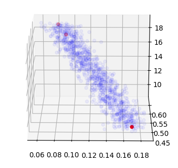

# Documentation for the ```HaploDX``` module

A comprehensive tutorial of the **HaploDX** module can be found on my personal webpage (<a href="https://www.normalesup.org/~tuyeras/node_diss/blg/home.php?page=blg_stat/stat_1/home.php">here</a>). This tutorial provides a holistic overview of the module, including its functions, features, and applications.

The present documentation, on the other hand, focuses on each function of the HaploDX module individually. It is recommended to first experiment with the functions presented in the [Data Generation](#data-generation) section, which will give you a good foundation for understanding the rest of the module.

* [Population and Allele Frequency Spectrum Modeling](#population-and-allele-frequency-spectrum-modeling)
  * [HaploDynamics.HaploDX.stochastic_line](#haplodynamicshaplodxstochastic_line)
  * [HaploDynamics.HaploDX.population_mut](#haplodynamicshaplodxpopulation_mut)
  * [HaploDynamics.HaploDX.afs_distribution](#haplodynamicshaplodxafs_distribution)
  * [HaploDynamics.HaploDX.afs_intervals](#haplodynamicshaplodxafs_intervals)
  * [HaploDynamics.HaploDX.afs_sample](#haplodynamicshaplodxafs_sample)
  * [HaploDynamics.HaploDX.genotype_schema](#haplodynamicshaplodxgenotype_schema)
  * [HaploDynamics.HaploDX.genotype](#haplodynamicshaplodxgenotype)
  * [HaploDynamics.HaploDX.gref](#haplodynamicshaplodxgref)
  * [HaploDynamics.HaploDX.population_mld](#haplodynamicshaplodxpopulation_mld)
* [LD and Hardy–Weinberg Principle Modeling](#ld-and-hardy–weinberg-principle-modeling)
  * [HaploDynamics.HaploDX.decay](#haplodynamicshaplodxdecay)
  * [HaploDynamics.HaploDX.ref_alt_function](#haplodynamicshaplodxref_alt_function)
  * [HaploDynamics.HaploDX.alt_alt_function](#haplodynamicshaplodxalt_alt_function)
  * [HaploDynamics.HaploDX.amplifier](#haplodynamicshaplodxamplifier)
  * [HaploDynamics.HaploDX.lb_freq](#haplodynamicshaplodxlb_freq)
  * [HaploDynamics.HaploDX.ub_freq](#haplodynamicshaplodxub_freq)
  * [HaploDynamics.HaploDX.linkage_disequilibrium](#haplodynamicshaplodxlinkage_disequilibrium)
  * [HaploDynamics.HaploDX.cond_genotype_schema](#haplodynamicshaplodxcond_genotype_schema)
* [Data Generation](#data-generation)
  * [HaploDynamics.HaploDX.SNP_distribution](#haplodynamicshaplodxsnp_distribution)
  * [HaploDynamics.HaploDX.initiate_block](#haplodynamicshaplodxinitiate_block)
  * [HaploDynamics.HaploDX.continue_block](#haplodynamicshaplodxcontinue_block)
  * [HaploDynamics.HaploDX.genmatrix](#haplodynamicshaplodxgenmatrix)
  * [HaploDynamics.HaploDX.gt_vcf](#haplodynamicshaplodxgt_vcf)
  * [HaploDynamics.HaploDX.create_vcfgz](#haplodynamicshaplodxcreate_vcfgz)
* [LD Analytics](#ld-analytics)
  * [HaploDynamics.HaploDX.LD_corr_matrix](#haplodynamicshaplodxld_corr_matrix)
  * [HaploDynamics.HaploDX.LD_r2_matrix](#haplodynamicshaplodxld_r2_matrix)
  * [HaploDynamics.HaploDX.display](#haplodynamicshaplodxdisplay)
  * [HaploDynamics.HaploDX.minor_haplotype](#haplodynamicshaplodxminor_haplotype)

&nbsp; 

---

## Population and Allele Frequency Spectrum Modeling
The functions presented here are based on research results borrowed from the literature. For more information on the functions' designs, please refer to the <a href="https://www.normalesup.org/~tuyeras/node_diss/blg/home.php?page=blg_stat/stat_1/home.php">tutorial</a>.

* [HaploDynamics.HaploDX.stochastic_line](#haplodynamicshaplodxstochastic_line)
* [HaploDynamics.HaploDX.population_mut](#haplodynamicshaplodxpopulation_mut)
* [HaploDynamics.HaploDX.afs_distribution](#haplodynamicshaplodxafs_distribution)
* [HaploDynamics.HaploDX.afs_intervals](#haplodynamicshaplodxafs_intervals)
* [HaploDynamics.HaploDX.afs_sample](#haplodynamicshaplodxafs_sample)
* [HaploDynamics.HaploDX.genotype_schema](#haplodynamicshaplodxgenotype_schema)
* [HaploDynamics.HaploDX.genotype](#haplodynamicshaplodxgenotype)
* [HaploDynamics.HaploDX.gref](#haplodynamicshaplodxgref)
* [HaploDynamics.HaploDX.population_mld](#haplodynamicshaplodxpopulation_mld)

&nbsp; 

### HaploDynamics.HaploDX.stochastic_line
```python
def stochastic_line(a: float,
                    b: float,
                    sigma: float
                    ) -> Callable[[float],float]
```
 <ins>Description</ins>
 - **abstract:** This function allows the user to parameterize an interval of floating-point numbers up to a stochastic error.
 - **inputs:**
   - ```a```: a floating-point number that represents the extreme end of an interval;
   - ```b```: a floating-point number that represents the other extreme end of the line;
   - ```sigma```: a floating-point number that represents a standard deviation.
 - **output:**
   - a function taking an input ```t: float``` and returning a floating-point number sampled from a Gaussian distribution whose mean is ```a*t+b*(1-t)``` and whose standard deviation is ```sigma```.

&nbsp; 

### HaploDynamics.HaploDX.population_mut
```python
population_mut = stochastic_line(0.08,0.17,0.01)
```
 <ins>Description</ins>
 - **abstract:** This function gives a stochastic parameterization of the interval $[0.08,0.17]$.
 - **inputs:**
   -  ```t```: a floating-point number in the interval $[0,1]$.
 - **output:**
   - a floating-point number sampled from a Gaussian distribution whose mean is ```a*t+b*(1-t)``` and whose standard deviation is ```sigma```.

&nbsp; 

### HaploDynamics.HaploDX.afs_distribution
```python
def afs_distribution(index: int,
                     alpha: float = 4/30
                     ) -> float
```
 <ins>Description</ins>
 - **abstract:** This function encodes a [discrete](https://en.wikipedia.org/wiki/Step_function) probability distribution of a set of allele frequency intervals for a given population. For more information, see the section "Introduction" in the <a href="https://www.normalesup.org/~tuyeras/node_diss/blg/home.php?page=blg_stat/stat_1/home.php">tutorial</a>.
 - **inputs:**
   -  ```index```: an integer $i$ in the interval $[0,15]$;
   - ```alpha```: a floating-point number that measures the proportion of rare mutations in a given population. This number is expected to be higher for populations that have experienced a bottleneck event (e.g. YRI is ```0.17```, CEU is ```0.9``` and CHB+JPT is ```0.8```);
       - <ins>Best practice:</ins> Use the **first** ouptut of the functions ```population_mut()``` or ```population_mld()``` to generate the value ```alpha```.
 - **output:**
   - a floating-point number representing the probability $p$ that an allele frequency is in the interval $[i/15,(i+1)/15]$ for a population characterized by the value ```alpha```.

&nbsp; 

### HaploDynamics.HaploDX.afs_intervals
```python
def afs_intervals(pick: float,
                  alpha: float = 4/30
                  ) -> list[float]
```
 <ins>Description</ins>
 - **abstract:** This function defines a random generator returning sub-intervals of $[0,1]$ according to the discrete probability distribution ```afs_distribution()```. For more information, see the section "Introduction" in the <a href="https://www.normalesup.org/~tuyeras/node_diss/blg/home.php?page=blg_stat/stat_1/home.php">tutorial</a>.
 - **inputs:**
   -  ```pick```: a floating-point number $p$ in the interval $[0,1]$;
   - ```alpha```: a floating-point number that measures the proportion of rare mutations in a given population. This number is expected to be lower for populations that have experienced a bottleneck event (e.g. YRI is ```0.17```, CEU is ```0.9``` and CHB+JPT is ```0.8```);
       - <ins>Best practice:</ins> Use the **first** ouptut of the functions ```population_mut()``` or ```population_mld()``` to generate the value ```alpha```.
 - **output:**
   - a list consisting of two floating-point numbers $i/15$ and $(i+1)/15$ such that $i$ is the minimal integer for which the following inequality holds: $$p < \int_0^{(i+1)/15}\delta(t)dt$$

     where $\delta$ denotes the piecewise probability distribution induced from the discrete probability distribution encoded by the process ```afs_distribution()```.

&nbsp; 

### HaploDynamics.HaploDX.afs_sample
```python
def afs_sample(alpha: float = 4/30
               ) -> float
```
 <ins>Description</ins>
 - **abstract:**  This function generalizes the random generator ```afs_intervals()```, which returns allele frequency intervals, into a random generator returning allele frequencies. For more information, ssee the section "Introduction" in the <a href="https://www.normalesup.org/~tuyeras/node_diss/blg/home.php?page=blg_stat/stat_1/home.php">tutorial</a>.
 - **inputs:** 
   - ```alpha```: a floating-point number that measures the proportion of rare mutations in a given population. This number is expected to be higher for populations that have experienced a bottleneck event (e.g. YRI is ```0.17```, CEU is ```0.9``` and CHB+JPT is ```0.8```);
       - <ins>Best practice:</ins> Use the **first** ouptut of the functions ```population_mut()``` or ```population_mld()``` to generate the value ```alpha```.
 - **output:**
   - a floating-point number encoding a (stochastic) allele frequency for a population characterized by the input value ```alpha```.

&nbsp; 

### HaploDynamics.HaploDX.genotype_schema
```python
def genotype_schema(alpha: float = 4/30
                    ) -> tuple[float,list[float]]
```
 <ins>Description</ins>
 - **abstract:**  This function returns information that can be used to simulate a vector $v$ of genetic variations at a hypothetical genetic position for a hypothetical population. The output of the function consists of two elements: a minor allele frequency $p$ and its associated Hardy-Weinberg probability distribution $Q$.
     - <ins>Implementation:</ins> The probability distribution $Q$ is encoded as a tiling of the interval $[0,1]$ so that it can be simulated via a [Monte Carlo process](https://en.wikipedia.org/wiki/Monte_Carlo_method). 

     For more information, see the section "Introduction" in the <a href="https://www.normalesup.org/~tuyeras/node_diss/blg/home.php?page=blg_stat/stat_1/home.php">tutorial</a>.
 - **inputs:**
   - ```alpha```: a floating-point number that measures the proportion of rare mutations in a given population. This number is expected to be higher for populations that have experienced a bottleneck event (e.g. YRI is ```0.17```, CEU is ```0.9``` and CHB+JPT is ```0.8```);
       - <ins>Best practice:</ins> Use the **first** ouptut of the functions ```population_mut()``` or ```population_mld()``` to generate the value ```alpha```.
 - **output:**
   - ```maf```: a floating-point number encoding a (stochastic) minor allele frequency $p$;
   - ```hwp```: a list of five floating-point numbers defining a tiling of the interval $[0,1]$. The tiling is given by five values $0,q_1,q_2,q_3,1$, which encode the Hardy-Weinberg distribution via the following equations:
      - $q_1-0 =  p^2 = \mathbb{P}(G_i = bb)$
      - $q_2-q_1 =  p(1-p) = \mathbb{P}(G_i = bc)$
      - $q_3-q_2 = p(1-p) =  \mathbb{P}(G_i = cb)$
      - $1-q_3 =  (1-p)^2 = \mathbb{P}(G_i = cc)$

     where $G_i$ denotes a random variable for the genotypes at a position $i$, and where $b$ and $c$ denote the minor and major alleles, respectively.

&nbsp; 

### HaploDynamics.HaploDX.genotype
```python
def genotype(hwp: list[float],
             minor: int
             ) -> tuple[int,int]
```
 <ins>Description</ins>
 - **abstract:** This function returns information characterizing a hypothetical genotype for a given individual at a given genetic position.
 - **inputs:**
   - ```hwp```: a list of five floating-point numbers defining a tiling of the interval $[0,1]$. This tiling is used with a [Monte Carlo process](https://en.wikipedia.org/wiki/Monte_Carlo_method) to simulate a Hardy-Weinberg probability distribution.
       - <ins>Best practice:</ins> Use the second outputs of the functions ```genotype_schema()``` or ```cond_genotype_schema()``` to generate the list ```hwp```;
   - ```minor ```: an integer value from the set $\lbrace 0,2\rbrace$ to indicate whether the minor allele of the hypothetical genotype corresponds to the nucleotide of a hypothetical reference genome sequence. 
       - <ins>Best practice:</ins> Use the value $0$ to simulate a situation where the minor allele corresponds to the nucleotide of the reference genome sequence.
 - **output:**
   - ```minor```: the value of the second argument passed to ```genotype()``` is returned here;
   - ```genotype_code```: an integer value representing the hypothetical genotype. This value is equal to 
     - ```minor``` if the genotype is a minor homozygous genotype;
     - ```2-minor``` if the genotype is a major homozygous genotype;
     - ```1-minor``` if the genotype consists of a minor-major pairing;
     - ```minor-1``` if the genotype consists of a major-minor pairing;

     See the function ```gref()``` to convert these values canonical representatives.

&nbsp; 

### HaploDynamics.HaploDX.gref
```python
gref= lambda g: g[1] if g[0] == 2 else (2-g[1])*(g[1] in [0,2]) - g[1]*(g[1] in [1,-1])
```
 <ins>Description</ins>
 - **abstract:** This function converts the outputs of the function ```genotype()``` into genotype values for which the homozygous genotype consisting of two major alleles is always $0$.
 - **inputs:**
   - ```g```: an output of the function ```genotype()```;
 - **output:**
   - a integer value from the set $\lbrace -1,0,1,2\rbrace$. Specificaly, the value $0$ represents the major homozygous genotype, the value $2$ represents the minor homozygous genotype, the value $1$ represents the minor-major genotype and the value $-1$ represents the major-minor genotype.

&nbsp; 

### HaploDynamics.HaploDX.population_mld
```python
def population_mld(t: float
                   ) -> tuple[float,float,float]
```
 <ins>Description</ins>
 - **abstract:** This function returns a triple $(\alpha,\beta,\gamma)$ of floating-point numbers used to define a population profile. Specifically, the triple $(\alpha,\beta,\gamma)$ consists of 
     - a bottleneck parameter $\alpha$, which characterizes the amount of rare mutation in a population.;
     - two parameters $\beta$ and $\gamma$, which define the amplitude and half-width of a decay behavior for the standard linkage disequilibrium measure $r^2$. 

   For more information, see the section "Hardy-Weinberg principle and linkage disequilibrium" in the <a href="https://www.normalesup.org/~tuyeras/node_diss/blg/home.php?page=blg_stat/stat_1/home.php">tutorial</a>.
 - **inputs:**
   - ```t```:  a floating-point number in the interval $[0,1]$, which is used through the function ```population_mld()``` to encode canonical population profiles via a linear parameterization.
 - **output:**
   - a triple $(\alpha,\beta,\gamma)$ of floating-point numbers located in the vicinity of a 3-dimensional line $H$. Each point $(x,y,z)$ that belongs to the line $H$ characterizes a canonical population profile defined by a bottleneck parameter $x$, along with an ampitude $y$ and a halfwidth $z$ for a population-specific LD decay. Any other point near the line $H$ is considered to be a statistical approximation of some canonical population profile. For illustration, the following plot shows a collection of points sampled from the outputs of the function ```population_mld()``` for different inputs ```t```.

     


&nbsp; 

## LD and Hardy–Weinberg Principle Modeling
The functions presented here use calculations of probabilities that relies on the generalization of the Hardy-Weinberg principle to genotypes. This generalization requires the use of a new linkage disequilibrium measure, $L$, which possesses homomorphic properties linking haplotypes to genotypes. For more information on how the measure $L$ relates to [standard linkage disequilibirum measures](https://en.wikipedia.org/wiki/Linkage_disequilibrium) such as $D$ and $r^2$, please refer to the <a href="https://www.normalesup.org/~tuyeras/node_diss/blg/home.php?page=blg_stat/stat_1/home.php">tutorial</a>. 

* [HaploDynamics.HaploDX.decay](#haplodynamicshaplodxdecay)
* [HaploDynamics.HaploDX.ref_alt_function](#haplodynamicshaplodxref_alt_function)
* [HaploDynamics.HaploDX.alt_alt_function](#haplodynamicshaplodxalt_alt_function)
* [HaploDynamics.HaploDX.amplifier](#haplodynamicshaplodxamplifier)
* [HaploDynamics.HaploDX.lb_freq](#haplodynamicshaplodxlb_freq)
* [HaploDynamics.HaploDX.ub_freq](#haplodynamicshaplodxub_freq)
* [HaploDynamics.HaploDX.linkage_disequilibrium](#haplodynamicshaplodxlinkage_disequilibrium)
* [HaploDynamics.HaploDX.cond_genotype_schema](#haplodynamicshaplodxcond_genotype_schema)

&nbsp; 

### HaploDynamics.HaploDX.decay
```python
def decay(initial: float,
          halfwidth: float,
          shift: float
          ) -> Callable[[float],float]
```
 <ins>Description</ins>
 - **abstract:** This function returns a callable item encoding a decay function $t \mapsto d(t)$. Following the standard terminology on decay functions, the parameter $t$ will be referred to as the _time parameter_.
 - **inputs:**
   - ```initial```: a floating-point number that encodes the amplitude $A$ of the decay function. This is the value of the decay function at time $t=0$;
   - ```halfwidth```: a floating-point number that encodes the halfwidth $T$ of the decay function. This is the time at which the function takes half of its initial value ```initial/2```;
   - ```shift```: a floating-point number that encodes a translation $\varepsilon$ to be applied to the time parameter.
 - **output:**
   - a decay function $d:t \mapsto A\cdot \mathsf{exp}(\mathsf{ln}(2) (t-\varepsilon)/T)$.

&nbsp; 

### HaploDynamics.HaploDX.ref_alt_function
```python
def ref_alt_function(y: float,
                     x: float
                     ) -> float
```
 <ins>Description</ins>
 - **abstract:** This function returns a callable item encoding a function $F:(y,x) \mapsto F_y(x)$. As shown in the <a href="https://www.normalesup.org/~tuyeras/node_diss/blg/home.php?page=blg_stat/stat_1/home.php">tutorial</a>, the function $F$ can be used to compute the amount of homomorphic linkage disequilibirum $L$ between a "reference allele" and an "alternate allele" at two different genetic positions $i$ and $j$. 
   - <ins>Terminoloy:</ins> Here, the adjective "reference" does not refer to an allele located on a reference genome sequence, but an allele _taken as a reference_ for the computation operated by the function $F$. For example, in the <a href="https://www.normalesup.org/~tuyeras/node_diss/blg/home.php?page=blg_stat/stat_1/home.php">tutorial</a>, the reference alleles for $F$ are all taken to be the minor alleles.
 - **inputs:**
   - ```y```: a floating-point number in the interval $[0,1)$ that represents a reference allele frequency at one of the correspoding positions $i$ or $j$. 
     - <ins>Note:</ins> In the <a href="https://www.normalesup.org/~tuyeras/node_diss/blg/home.php?page=blg_stat/stat_1/home.php">tutorial</a>, this reference allele frequency was denoted by either $p$ or $q$ depending on the allelic combinations considered;
   - ```x```: a floating-point number that represents the amount of homomorphic linkage disequilibirum $L$ between the two reference alleles at the positions $i$ and $j$;
 - **output:**
   - a floating-point number that measures the amount of homomorphic linkage disequilibirum $L$ between an alternate allele and a reference allele.

&nbsp; 

### HaploDynamics.HaploDX.alt_alt_function
```python
def alt_alt_function(y: float,
                     z: float,
                     x: float
                     ) -> float
```
 <ins>Description</ins>
 - **abstract:** This function returns a callable item encoding a function $G:(y,z,x) \mapsto G_{y,z}(x)$. As shown in the <a href="https://www.normalesup.org/~tuyeras/node_diss/blg/home.php?page=blg_stat/stat_1/home.php">tutorial</a>, the function $G$ can be used to compute the amount of homomorphic linkage disequilibirum $L$ between two "alternate alleles" at two different genetic positions $i$ and $j$.
   - <ins>Terminoloy:</ins> Even though we define the antonym of the term "alternate allele" to be the term "reference allele", this nomenclature does not refer to an allele located on a reference genome sequence. Instead, it refers to an allele _taken as a reference_ for the computation operated by the function $G$. For example, in the <a href="https://www.normalesup.org/~tuyeras/node_diss/blg/home.php?page=blg_stat/stat_1/home.php">tutorial</a>, the reference alleles for $G$ are all taken to be the minor alleles.
 - **inputs:**
   - ```y```: a floating-point number in the interval $[0,1)$ that represents a reference allele frequency $p$ at the position $i$;
   - ```z```: a floating-point number in the interval $[0,1)$ that represents a reference allele frequency $q$ at the position $j$;
   - ```x```: a floating-point number that represents the amount of homomorphic linkage disequilibirum $L$ between the two reference alleles at the positions $i$ and $j$;
 - **output:**
   - a floating-point number that measures the amount of homomorphic linkage disequilibirum $L$ betwen two alternate alleles.

&nbsp; 

### HaploDynamics.HaploDX.amplifier
```python
def amplifier(beta: float,
              p: float,
              q: float,
              s: float = 1
              ) -> float
```
 <ins>Description</ins>
 - **abstract:** As shown in the <a href="https://www.normalesup.org/~tuyeras/node_diss/blg/home.php?page=blg_stat/stat_1/home.php">tutorial</a>, the homomorphic LD measure $L$ inherits a decay behavior from the decay behavior of the standard LD measure $r^2$. In this respect, the measure $L$ is characterized by an amplitude $\rho'$, a halfwidth $\gamma'$ and a translation parameter $\varepsilon'$. The function ```amplifier()``` can be used to compute the amplitude $\rho'$, which is given by a formula $\rho' = \sqrt{\beta(1/p-1)(1/q-1)}$ where $\beta$ is the amplitude of the measure $r^2$, and $p$ and $q$ are the minor allele frequencies associated with the genetic positions used to define the amount of LD.
 - **inputs:**
   - ```beta```: an amplitude $\beta$ for the decay behavior of the standard LD measure $r^2$. 
       - <ins>Best practice:</ins> Use the **second** ouptut of the function ```population_mld()``` to generate the value ```beta```.
   - ```p```: a floating-point number in the interval $[0,1)$ that represents a minor allele frequency $p$ at a genetic position $i$;
   - ```q```: a floating-point number in the interval $[0,1)$ that represents a minor allele frequency $q$ at a genetic position $j$;
   - ```s```: an (optional) floating-point number $s$, which can be used to rescale the amplitude of the measure $L$.
 - **output:**
   - a floating-point number equal to the number $ s \rho' = s\sqrt{\beta(1/p-1)(1/q-1)}$.

&nbsp; 

### HaploDynamics.HaploDX.lb_freq
```python
def lb_freq(beta: float,
            gamma: float,
            previous_freq: float,
            distance: float,
            shift: float
            ) -> float
```
 <ins>Description</ins>
 - **abstract:**  Given the followign data:
     - an amount of linkage disequilibrium between two genetic positions $i$ and $j$,
     - and a minor allele frequency $p$ associated with the position $i$.

     this function returns a lower bound for the minor allele frequency $q$ associated with position $j$. The amount of linkage disequilibrium will be determined by a triple $(\beta,\gamma,\varepsilon)$ where $\beta$, $\gamma$, $\varepsilon$ define the amplitude, halfwidth and translation parameters for a decay function returned by the process ```decay()```. 
 - **inputs:**
   - ```beta```: a floating-point number that represents the amplitude $\beta$ of the decay behavior for the standard LD measure $r^2$;
       - <ins>Best practice:</ins> Use the **second** ouptut of the function ```population_mld()``` to generate the value ```beta```.
   - ```gamma```: a floating-point number that represents the halfwidth $\gamma$ of the decay behavior for the standard LD measure $r^2$;
       - <ins>Best practice:</ins> Use the **third** ouptut of the function ```population_mld()``` to generate the value ```gamma```.
   - ```previous_freq```: a floating-point number that represents the minor allele frequency $p$ associated with the position $i$;
   - ```distance```: a floating-point number that represents the genetic distance (in kilobases) between the two genetic positions $i$ and $j$;
   - ```shift```: the translation parameter $\varepsilon$ for the decay behavior of the standard LD measure $r^2$.
 - **output:**
   - a floating-point number representing a lower bound value for the minor allele frequency $q$ at the position $j$

&nbsp; 

### HaploDynamics.HaploDX.ub_freq
```python
def ub_freq(beta: float,
            gamma: float,
            previous_freq: float,
            distance: float,
            shift: float
            ) -> float
```
 <ins>Description</ins>
 - **abstract:**  Given the followign data:
     - an amount of linkage disequilibrium between two genetic positions $i$ and $j$,
     - and a minor allele frequency $p$ associated with the position $i$.

     this function returns an upper bound for the minor allele frequency $q$ associated with position $j$. The amount of linkage disequilibrium will be determined by a triple $(\beta,\gamma,\varepsilon)$ where $\beta$, $\gamma$, $\varepsilon$ define the amplitude, halfwidth and translation parameters for a decay function returned by the process ```decay()```. 
 - **inputs:**
   - ```beta```: a floating-point number that represents the amplitude $\beta$ of the decay behavior for the standard LD measure $r^2$;
       - <ins>Best practice:</ins> Use the **second** ouptut of the function ```population_mld()``` to generate the value ```beta```.
   - ```gamma```: a floating-point number that represents the halfwidth $\gamma$ of the decay behavior for the standard LD measure $r^2$;
       - <ins>Best practice:</ins> Use the **third** ouptut of the function ```population_mld()``` to generate the value ```gamma```.
   - ```previous_freq```: a floating-point number that represents the minor allele frequency $p$ associated with the position $i$;
   - ```distance```: a floating-point number that represents the genetic distance (in kilobases) between the two genetic positions $i$ and $j$;
   - ```shift```: the translation parameter $\varepsilon$ for the decay behavior of the standard LD measure $r^2$.
 - **output:**
   - a floating-point number representing an upper bound value for the minor allele frequency $q$ at the position $j$

&nbsp; 

### HaploDynamics.HaploDX.linkage_disequilibrium
```python
def linkage_disequilibrium(alpha: float,
                           beta: float,
                           gamma: float,
                           strength: float = -1
                           ) -> Callable[[float],Callable[[float],tuple[float,float]]]
```
 <ins>Description</ins>
 - **abstract:** This function returns a stochastic mapping $$L_{\alpha,\beta,\gamma}:t \mapsto \big( L_{\alpha,\beta,\gamma}(t): p \mapsto (\ell,q)\big)$$ whose output $(\ell,q) = L_{\alpha,\beta,\gamma}(t)(p)$ satisfies the following properties:
     - the value $\ell$ measures the amount of homomorphic linkage disequilibrium between two hypothetical variants at two different positions;
     - the variant at position $i$ has a minor allele frequency $p$;
     - the variant at position $j$ has a minor allele frequency $q$;
     - the two variants are separated by a genetic distance equal to $t$ (in kilobases);
 - **inputs:**
   - ```alpha```: a bottleneck parameter $\alpha$ that characterizes the amount of rare mutations in a population (e.g. YRI is ```0.17```, CEU is ```0.9``` and CHB+JPT is ```0.8```);
       - <ins>Best practice:</ins> Use the **first** ouptut of the function ```population_mld()``` to generate the value ```alpha```.
   - ```beta```: an amplitude $\beta$ for the decay behavior of the standard LD measure $r^2$ (e.g. YRI is ```0.45```, CEU is ```0.60``` and CHB+JPT is ```0.62```);
       - <ins>Best practice:</ins> Use the **second** ouptut of the function ```population_mld()``` to generate the value ```beta```.
   - ```gamma```: a halfwidth $\gamma$ for the decay behavior of the standard LD measure $r^2$ (e.g. YRI is ```9```, CEU is ```18``` and CHB+JPT is ```16```); 
       - <ins>Best practice:</ins> Use the **third** ouptut of the function ```population_mld()``` to generate the value ```gamma```.
   - ```strength```: a floating-point number in the interval $[-1,1]$ that represents the strength of the linkage disequilibrium. For example, a strength of $1$ refers to the maximum value that the linkage disequilibrium measure can take given the values of the parameters $t$, $p$, $\beta$ and $\gamma$. See the <a href="https://www.normalesup.org/~tuyeras/node_diss/blg/home.php?page=blg_stat/stat_1/home.php">tutorial</a> to learn more about the parameter ```strength```.
 - **output:**
   - a stochastic process $t \mapsto p \mapsto (\ell,q)$ where $\ell$ measures the amount of linkage disequilibrium between two genetic positions separated by a distance of $t$ kilobase, and where $p$ and $q$ represent the minor allele frequencies at these genetic positions, respectively.

&nbsp; 

### HaploDynamics.HaploDX.cond_genotype_schema
```python
def cond_genotype_schema(previous_maf: float,
                         distance: float,
                         alpha: float,
                         beta: float,
                         gamma: float,
                         strength: float = -1
                         ) -> tuple[float,Callable[[tuple[int,int]],list[float]],float]
```
 <ins>Description</ins>
 - **abstract:** This function returns a probability distribution that generalizes the Hardy-Weinberg distribution to genotypes (for a given individual). The distribution takes the form of conditional probability distribution $$a_1a_2 \mapsto \mathbb{P}(G_j = b_1b_2~|~G_i = a_1a_2)$$ where $a_1a_2$ represents a genotype at a position $i$ and $b_1b_2$ represents a genotype at a position $j$.
     - <ins>Implementation:</ins> The probability distribution returned by the function ```cond_genotype_schema()``` is encoded as a tiling of the interval $[0,1]$ so that it can be simulated via a [Monte Carlo process](https://en.wikipedia.org/wiki/Monte_Carlo_method). 
 - **inputs:**
   - ```previous_maf```: a floating-point number that represents the minor allele frequency $p$ associated with position $i$;
   - ```distance```: a floating-point number that represents the distance $t$ (in kilobases) between the two positions $i$ and $j$;
   - ```alpha```: a bottleneck parameter $\alpha$ that characterizes the amount of rare mutations in a population (e.g. YRI is ```0.17```, CEU is ```0.9``` and CHB+JPT is ```0.8```);
       - <ins>Best practice:</ins> Use the **first** ouptut of the function ```population_mld()``` to generate the value ```alpha```.
   - ```beta```: an amplitude $\beta$ for the decay behavior of the standard LD measure $r^2$ (e.g. YRI is ```0.45```, CEU is ```0.60``` and CHB+JPT is ```0.62```);
       - <ins>Best practice:</ins> Use the **second** ouptut of the function ```population_mld()``` to generate the value ```beta```.
   - ```gamma```: a halfwidth $\gamma$ for the decay behavior of the standard LD measure $r^2$ (e.g. YRI is ```9```, CEU is ```18``` and CHB+JPT is ```16```);
       - <ins>Best practice:</ins> Use the **third** ouptut of the function ```population_mld()``` to generate the value ```gamma```.
   - ```strength```: a floating-point number in the interval $[-1,1]$ that represents the strength of the linkage disequilibrium. For example, a strength of $1$ refers to the maximum value that the linkage disequilibrium measure can take given the values of the parameters $t$, $p$, $\beta$ and $\gamma$. See the <a href="https://www.normalesup.org/~tuyeras/node_diss/blg/home.php?page=blg_stat/stat_1/home.php">tutorial</a> to learn more about the parameter ```strength```.
 - **output:**
   - ```maf```: a floating-point number that encodes a (stochastic) minor allele frequency $q$ for the genotype at position $j$. 
     - <ins>Implementation:</ins> the number ```maf``` is typically returned by the second output of a stochastic function $t \mapsto p \mapsto (\ell,q)$ generated by the process ```linkage_disequilibrium(alpha,beta,gamma,strength)```;
   - ```hwp```: a callable item that returns a tiling of the interval $[0,1]$ for a given genotype encoded as an output of the function ```gref()```. 
     - _input:_  the inputs of the function ```hwp()``` are typically defined by the outputs of the function ```gref()```. Each of these outputs is representative of a genotype $a_1a_2$, which can be generated by the stochastic procress ```genotype()```. Because ```genotype()``` can generate different representations for the same genotype, the ouputs of ```genotype()``` must be _normalized_ by ```gref()```. In this respect, the function ```hwp()``` would typically take inputs genetared by the stochastic process ```gref(genotype())```.
     - _output:_ for every input genotype $a_1a_2$, the function ```hwp()``` returns a list of five floating-point numbers: $0,q_1,q_2,q_3,1$. These numbers define a generalization of the Hardy-Weinberg distribution based on the following equations:
       - $q_1-0 =  \mathbb{P}(G_j = bb~|~G_i = a_1a_2)$
       - $q_2-q_1 =  \mathbb{P}(G_j = bc~|~G_i = a_1a_2)$
       - $q_3-q_2 = \mathbb{P}(G_j = cb~|~G_i = a_1a_2)$
       - $1-q_3 =  \mathbb{P}(G_j = cc~|~G_i = a_1a_2)$

       where (1) $G_i$ and $G_j$ denote random variables for the genotypes at the positions $i$ and $j$, respectively; and (2) $b$ and $c$ denote the minor and major alleles at position $j$, respectively.
   - ```ld```: a floating-point number $\ell$ measuring the amount of linkage disequilibrium between the two variants at the positions $i$ and $j$.
     - <ins>Implementation:</ins> the number ```ld``` is typically returned by the first output of the stochastic function $t \mapsto p \mapsto (\ell,q)$ that would be generated by the process ```linkage_disequilibrium(alpha,beta,gamma,strength)```;


&nbsp; 

## Data Generation
The functions presented here can be used to implement simulators of variant call data. The function ```genmatrix()``` is a typical example of this. For more information about the implementation of ```genmatrix()```, please refer to the <a href="https://www.normalesup.org/~tuyeras/node_diss/blg/home.php?page=blg_stat/stat_1/home.php">tutorial</a>.

* [HaploDynamics.HaploDX.SNP_distribution](#haplodynamicshaplodxsnp_distribution)
* [HaploDynamics.HaploDX.initiate_block](#haplodynamicshaplodxinitiate_block)
* [HaploDynamics.HaploDX.continue_block](#haplodynamicshaplodxcontinue_block)
* [HaploDynamics.HaploDX.genmatrix](#haplodynamicshaplodxgenmatrix)
* [HaploDynamics.HaploDX.gt_vcf](#haplodynamicshaplodxgt_vcf)
* [HaploDynamics.HaploDX.create_vcfgz](#haplodynamicshaplodxcreate_vcfgz)

&nbsp; 

### HaploDynamics.HaploDX.SNP_distribution
```python
def SNP_distribution(reference: float,
                     length: float
                     ) -> list[float]
```
 <ins>Description</ins>
 - **abstract:** This function generates a list of successive genetic positions (in kilobases) that can be used as a positional template to simulate variant call data. On average, the output list contains one genetic position every 1kb.
 - **inputs:**
   - ```reference```: a floating-point number that represents the least genetic position of the output list;
   - ```length```: a floating-point number that represents a distance in kilobase.
 - **output:**
   - a list containing exactly ```int(length)``` floating-point numbers, sorted from least to greatest, all comprised between the values ```0.002+reference``` and ```0.002+reference+length```, and all separated by at least $1$ base (_i.e._ distant from each other by at least ```0.002```).

&nbsp; 

### HaploDynamics.HaploDX.initiate_block
```python
def initiate_block(reference: float,
                   alpha: float,
                   Npop: int = 1000
                   ) -> tuple[float,list[list[tuple[int,int]]],list[list[float]]]
```
 <ins>Description</ins>
 - **abstract:** This function generates the very first row of a simulated variant call dataset. Specifically, it returns a vector of genotypes indexed by the genetic position ```reference``` (in kilobases) and controled by the parameter on the value ```alpha```.
 - **inputs:**
   - ```reference```: a floating-point number used as the least genetic position to index the simulated dataset;
   - ```alpha```: a bottleneck parameter $\alpha$ that characterizes the amount of rare mutations in a population (e.g. YRI is ```0.17```, CEU is ```0.9``` and CHB+JPT is ```0.8```);
       - <ins>Best practice:</ins> Use the **first** ouptut of the functions ```population_mut()``` or ```population_mld()``` to generate the value ```alpha```.
   - ```Npop```: an integer $N$ that represents the number of individuals in the simulated dataset. The resulting population will be characterized by the bottleneck parameter ```alpha``` at the position ```reference```.
 - **output:**
   - ```maf```: a floating-point number that _estimates_ the allele frequency $p$ associated with the genetic position ```reference``` in the simulated dataset;
   - ```pre_matrix```: a singleton list $[v]$ whose element $v$ is a list $[v_1,v_2,\dots,v_N]$ such that each element $v_i$ is an output of the function ```genotype()```. As such, each element $v_i$ is encoded as a pair $(v_i[0],v_i[1])$;
   - ```matrix```: a singleton list $[w]$ whose element $w$ is a list obtained as a concatenation of: 
       - the singleton list $[r]$ whose element $r$ is the value ```reference```; _together with_
       - the list resulting from applying the function ```lambda x: x[1]``` on each element of the list $v$.

     In other words, the following equation holds:
     $$w = (r,v_1[1],v_2[1],\dots,v_N[1])$$

&nbsp; 

### HaploDynamics.HaploDX.continue_block
```python
def continue_block(maf0: float,
                   pre_matrix: list[list[tuple[int,int]]],
                   matrix: list[list[float]],
                   positions: list[float],
                   alpha: float,
                   beta: float,
                   gamma: float,
                   strength: int = -1,
                   Npop: int = 1000
                   ) -> tuple[float,list[list[tuple[int,int]]],list[list[float]]]
```
 <ins>Description</ins>
 - **abstract:** This function continues the generation process initiated by the function ```initiate_block()``` by augmenting the tables ```matrix``` and ```pre_matrix``` with additional rows. In this case, the generation process is controled by the linkage disequilibrium parameters ```beta``` and ```gamma``` and the bottleneck parameter ```alpha```.
 - **inputs:**
   - ```maf0```: a floating-point number that _estimates_ the allele frequency $p$ associated with the greatest genetic position indexing the data of the input ```matrix```;
   - ```pre_matrix```: a list $v = [v_1,v_2,\dots,v_M]$ whose elements $v_j$ are lists $[v_{j,1},v_{j,2},\dots,v_{j,N}]$ of length equal to the input ```Npop``` such that each element $v_{j,i}$ is an output of the function ```genotype()```. As such, the element $v_{j,i}$ is encoded by a pair $(m_j,v_{j,i}[1])$ where $v_{j,i}[0] = m_j$ for every index $i$;
   - ```matrix```: a list $w = [w_1,w_2,\dots,w_M]$ whose elements $w_j$ are lists obtained as concatenations of: 
       - a singleton list $[r]$ where $r$ encodes a genetic position in kilobases; _together with_
       - the list resulting from applying the function ```lambda x: x[1]``` on each element of the list $v_j$.

     In other words, the following equation holds:
     $$w_j = (r,v_{j,1}[1],v_{j,2}[1],\dots,v_{j,N}[1]])$$

   - ```positions```: a list of floating-point numbers, sorted from least to greatest, all greater than the value contained in ```matrix[-1][0]```, and all separated by at least a distance of ```0.001``` (equivalent to 1 base).
   - ```alpha```: a bottleneck parameter $\alpha$ characterizing the amount of rare mutations in a population (e.g. YRI is ```0.17```, CEU is ```0.9``` and CHB+JPT is ```0.8```);
       - <ins>Best practice:</ins> Use the **first** ouptut of the function ```population_mld()``` to generate the value ```alpha```.
   - ```beta```: an amplitude $\beta$ for the decay behavior of the standard LD measure $r^2$ (e.g. YRI is ```0.45```, CEU is ```0.60``` and CHB+JPT is ```0.62```);
       - <ins>Best practice:</ins> Use the **second** ouptut of the function ```population_mld()``` to generate the value ```beta```.
   - ```gamma```: a halfwidth $\gamma$ for the decay behavior of the standard LD measure $r^2$ (e.g. YRI is ```9```, CEU is ```18``` and CHB+JPT is ```16```);
       - <ins>Best practice:</ins> Use the **third** ouptut of the function ```population_mld()``` to generate the value ```gamma```.
   - ```strength```: a floating-point number in the interval $[-1,1]$ that represents the strength of the linkage disequilibrium. For example, a strength of $1$ refers to the maximum value that the linkage disequilibrium measure can take given the values of the parameters $\beta$ and $\gamma$. See the <a href="https://www.normalesup.org/~tuyeras/node_diss/blg/home.php?page=blg_stat/stat_1/home.php">tutorial</a> to learn more about the parameter ```strength```.
   - ```Npop```: an integer $N$ that represents the number of individuals in the simulated dataset. Overall, the resulting population will tend to be characterized by the parameters ```alpha```, ```beta``` and ```gamma```.
 - **output:**
   - ```maf```: a floating-point number that _estimates_ the allele frequency $p$ associated with the greatest genetic position in the simulated dataset;
   - ```pre_matrix```: a list $v' = [v_1',v_2',\dots,v_{M'}']$ whose elements $v_j'$ are lists $[v_{j,1}',v_{j,2}',\dots,v_{j,N}']$ such that
       * the matrix $v'$ is an extension of the matrix $v$ for which the difference in length $M'-M$ is equal to ```len(positions)```; and 
       * every element $v_{j,i}'$ is an output of the function ```genotype()```. As such, the element $v_{j,i}'$ is encoded by a pair $(m_j',v_{j,i}'[1])$ where $v_{j,i}'[0] = m_j'$ for every index $i$;

   - ```matrix```: a list $w' = [w_1',w_2',\dots,w_{M'}']$ extending the matrix $w$ such that the difference in length $M'-M$ is equal to ```len(positions)``` and every added element $w_{M+j}'$ is a list obtained as the concatenation of: 
       - the singleton list $[r]$ containing the $j$-th element $r$ of the list ```positions```; _together with_
       - the list resulting from applying the function ```lambda x: x[1]``` on each element of the list $v_j$.

     In other words, the following equation holds:
     $$w_j' = (r,v_{j,1}'[1],v_{j,2}'[1],\dots,v_{j,N}'[1]])$$

&nbsp; 

### HaploDynamics.HaploDX.genmatrix
```python
def genmatrix(blocks: list[int],
              strength: float,
              population: float,
              Npop: int
              ) -> tuple[list[list[float]],float,float,float]
```
 <ins>Description</ins>
 - **abstract:** This function implements a basic variant call data simulator. Its implementation relies on the three processes ```SNP_distribution()```, ```initiate_block()``` and ```continue_block()```. See the module ```Framework``` for possible improvements or variations of this function.
 - **inputs:**
   - ```blocks```: a list of integer values used to encode blocks of genetic positions linked together by an amount of linkage disequilibrium determined by a decay function. The genetic positions generated for each block are used to index the data contained in the output ```matrix```;
   - ```strength```: a floating-point number in the interval $[-1,1]$ that represents the strength of the linkage disequilibrium. For example, a strength of $1$ refers to the maximum value that the linkage disequilibrium measure can take given the values of the parameters generated during the siumlation. See the <a href="https://www.normalesup.org/~tuyeras/node_diss/blg/home.php?page=blg_stat/stat_1/home.php">tutorial</a> to learn more about the parameter ```strength```;
   - ```population```: a floating-point number in the interval $[0,1]$, which is given as an input to the function ```population_mld()``` to generate a stochastic population profile;
   - ```Npop```: an integer $N$ that represents the number of individuals in the simulated dataset.
 - **output:**
   - ```matrix```: a list $w = [w_1,w_2,\dots,w_M]$ whose elements $w_j$ are lists $[w_{j,0},w_{j,1},\dots,w_{j,N}]$ such that
       - the coefficient $w_{j,0}$ is a genetic position generated from the function ```SNP_distribution()``` by using the lengths contained in the list ```blocks```. The integer $M$, which bounds the index $j$, will always be equal to the sum ```sum(blocks)+1```;
       - the coefficient $w_{j,i}$, for every $i \in \lbrace 1,2,\dots,N\rbrace$, belongs to the space of values generated by the second output of the process ```genotype()```.

     In other words, the following equation holds:
     $$w_j = (r,v_{j,1}[1],v_{j,2}[1],\dots,v_{j,N}[1]])$$
   - ```alpha_mld```: a bottleneck parameter $\alpha$ that characterizes the amount of rare mutations in the simulated population;
   - ```beta_mld```: an amplitude $\beta$ used for the decay behavior of the standard LD measure $r^2$ pertaining to the simulated population;
   - ```gamma_mld```: a halfwidth $\gamma$ used for the decay behavior of the standard LD measure $r^2$ pertaining to the simulated population.

&nbsp; 

### HaploDynamics.HaploDX.gt_vcf
```python
def gt_vcf(value: int
           )-> str
```
 <ins>Description</ins>
 - **abstract:** This function should be used to convert the genotype values returned by ```gref()``` into VCF genotype encodings of the form ```0|0```, ```0|1```, ```1|0``` and ```1|1```.
 - **inputs:**
   - ```value```: an integer value that represents a genotype, typically returned by the function ```gref()```.
 - **output:**
   - a string representing a genotype for the _variant call format_ (VCF). The integer $0$ is converted into the string ```0|0```, the integer $1$ is converted into ```0|1```, the integer $-1$ is converted into ```1|0``` and the integer $2$ is converted inot the string ```1|1```.

&nbsp; 

### HaploDynamics.HaploDX.create_vcfgz
```python
def create_vcfgz(vcf_name: str,
                 matrix: list[list[float]],
                 alpha: float,
                 beta: float,
                 gamma: float,
                 system: str = "unix"
                 ) -> None
```
 <ins>Description</ins>
 - **abstract:** This function generates a compressed VCF file gathering the information contained in a matrix of simulated variant call data. This matrix can be obtained from the processes ```initiate_block()```, ```continue_block()``` or ```genmatrix()```.
 - **inputs:**
   - ```vcf_name```: a string that represents the name of the VCF file without its file extension ```"vcf.gz"```.
   - ```matrix```: a list $w = [w_1,w_2,\dots,w_M]$ whose elements $w_j$ are lists $[w_{j,0},w_{j,1},\dots,w_{j,N}]$ such that
       - the coefficient $w_{j,0}$ is a genetic position in kilobases; and
       - the coefficient $w_{j,i}$, for every $i \in \lbrace 1,2,\dots,N\rbrace$, belongs to the space of values generated by the second output of the process ```genotype()```.

   - ```alpha```: a bottleneck parameter $\alpha$ characterizing the amount of rare mutations in a population;
       - <ins>Best practice:</ins> This parameter should relate to the parameter $\alpha$ used with the processes ```initiate_block()```, ```continue_block()``` or returned by the process ```genmatrix()```.
   - ```beta```: an amplitude $\beta$ for the decay behavior of the standard LD measure $r^2$;
       - <ins>Best practice:</ins> This parameter should relate to the parameter $\beta$ used with the processes ```initiate_block()```, ```continue_block()``` or returned by the process ```genmatrix()```.
   - ```gamma```: a halfwidth $\gamma$ for the decay behavior of the standard LD measure $r^2$;
       - <ins>Best practice:</ins> This parameter should relate to the parameter $\gamma$ used with the processes ```initiate_block()```, ```continue_block()``` or returned by the process ```genmatrix()```.
   - ```system```: a string that is either equal to ```"unix"``` or any other string. If the string is equal to ```"unix"```, then every end of line of the VCF file is formatted according to unix systems (i.e using the character ```\n```). Otherwise, the end of line is formatted according to windows systems (i.e using the character ```\r\n```).
 - **output:**
   - a VCF file containing the information of the input ```matrix```. The file is saved starting from the current directory at the location indicated by the string ```vcf_name +".vcf.gz"```.


&nbsp;  

## LD Analytics
The functions presented in this section can be used to visualize LD-related information from the data generated by the functions presented in the [Data Generation](#data-generation) section.

* [HaploDynamics.HaploDX.LD_corr_matrix](#haplodynamicshaplodxld_corr_matrix)
* [HaploDynamics.HaploDX.LD_r2_matrix](#haplodynamicshaplodxld_r2_matrix)
* [HaploDynamics.HaploDX.display](#haplodynamicshaplodxdisplay)
* [HaploDynamics.HaploDX.minor_haplotype](#haplodynamicshaplodxminor_haplotype)

&nbsp; 

### HaploDynamics.HaploDX.LD_corr_matrix
```python
def LD_corr_matrix(matrix: list[list[float]]
                   ) -> tuple[list[list[float]],float,list[float]]
```
 <ins>Description</ins>
 - **abstract:** This function generates a (non-normalized) correlation matrix from the output```matrix``` generated by either ```initiate_block()```, ```continue_block()``` or ```genmatrix()```
 - **inputs:**
   - ```matrix```: a list $w = [w_1,w_2,\dots,w_M]$ whose elements $w_j$ are lists $[w_{j,0},w_{j,1},\dots,w_{j,N}]$ such that
       - the coefficient $w_{j,0}$ is a genetic position in kilobases; and
       - the coefficient $w_{j,i}$, for every $i \in \lbrace 1,2,\dots,N\rbrace$, belongs to the space of values generated by the second output of the process ```genotype()```.
 - **output:**
   - ```rel```: a matrix of floating-point numbers containing Pearson's correlation scores $\rho_{i,j}$ between pairs $(w_i,w_j)$ of vectors taken from the input matrix $w$;
   - ```m```: the maximal absolute value of the coefficients in the matrix ```rel```, namely $m = \mathsf{max}\lbrace |\rho_{i,j}|~|~i,j \rbrace$;
   - ```dist```: a list of floating-point numbers $d$ whose $i$-th coefficients $d[i]$ is the average correlation scores between two variants separated by a distance of around $i$ kilobases. 
       - <ins>Best practice:</ins> The first coefficient $d[0]$ is typically a residual from variants whose distance is strictly between $0$ and $1$. This is because the correlation score between two variants that are exactly $0$ kilobases apart is undefined. As a result, the first coefficient $d[0]$ is not representative of a proper distance of $0$ kilobases and should not be included in your analysis.

&nbsp; 

### HaploDynamics.HaploDX.LD_r2_matrix
```python
def LD_r2_matrix(pre_matrix: list[list[tupple[int,int]]]
                 ) -> tuple[list[list[float]],float,list[float]]
```
 <ins>Description</ins>
 - **abstract:** This function generates a (non-normalized) LD-$r^2$ score matrix from the output ```pre_matrix``` generated by either ```initiate_block()``` or ```continue_block()```. Note that the function ```LD_r2_matrix()``` cannot be used with the process ```genmatrix()``` since this process does not return the input needed for the function ```LD_r2_matrix()```.
 - **inputs:**
   - ```pre_matrix```: a list $v = [v_1,v_2,\dots,v_M]$ whose elements $v_j$ are lists $[v_{j,1},v_{j,2},\dots,v_{j,N}]$ such that each element $v_{j,i}$ is an output of the function ```genotype()```. As such, the element $v_{j,i}$ is encoded by a pair $(m_j,v_{j,i}[1])$ where $v_{j,i}[0] = m_j$ for every index $i$.
 - **output:**
   - ```rel```: a matrix of floating-point numbers containing LD $r^2$ scores $r^2_{i,j}$ between pairs $(v_i,v_j)$ of vectors taken from the input matrix $v$;
   - ```m```: the maximal absolute value of the coefficients in the matrix ```rel```, namely $m = \mathsf{max}\lbrace |r^2_{i,j}|~|~i,j \rbrace$;
   - ```dist```: a list of floating-point numbers $d$ whose $i$-th coefficients $d[i]$ is the average LD $r^2$ scores between two variants separated by a distance of around $i$ kilobases. 
       - <ins>Best practice:</ins> The first coefficient $d[0]$ is typically a residual from variants whose distance is strictly between $0$ and $1$. This is because the LD-$r^2$ score between two variants that are exactly $0$ kilobases apart is undefined. As a result, the first coefficient $d[0]$ is not representative of a proper distance of $0$ kilobases and should not be included in your analysis.

&nbsp; 

### HaploDynamics.HaploDX.display
```python
def display(rel: list[list[float]],
            m: float
            ) -> list[list[tuple[float,float,float]]]
```
 <ins>Description</ins>
 - **abstract:** This function returns a displayable table of RGB codes representing the values of the input matrix ```rel```.
 - **inputs:**
   - ```rel```: a matrix of floating-point numbers.
   - ```m```: a positive floating-point number used to normalize the coefficient of the matrix ```rel```. This value is typically the maximal absolute value of the coefficients in ```rel```.
 - **output:**
   - ```image```: a matrix containing triple floating-point numbers, each encoding an RGB code representing the intensity of the values in the matrix ```rel```. This matrix can be directly processed by plotting functions such as ```matplotlib.pyplot.plot()``` (more information about this plotting function [here](https://matplotlib.org/stable/api/_as_gen/matplotlib.pyplot.plot.html#matplotlib-pyplot-plot))

&nbsp; 

### HaploDynamics.HaploDX.minor_haplotype
```python
def minor_haplotype(sub_pre_matrix: list[list[tupple[int,int]]]
                    ) -> float
```
 <ins>Description</ins>
 - **abstract:** This function returns the frequency of the haplotype that contains all the minor alleles from a dataset of genotypes for given population.
 - **inputs:**
   - ```sub_pre_matrix```: a list $v = [v_1,v_2,\dots,v_M]$ whose elements $v_j$ are lists $[v_{j,1},v_{j,2},\dots,v_{j,N}]$ such that each element $v_{j,i}$ is an output of the function ```genotype()```. As such, the element $v_{j,i}$ is encoded by a pair $(m_j,v_{j,i}[1])$ where $v_{j,i}[0] = m_j$ for every index $i$.
 - **output:**
   - a  floating-point number representing the frequency of the minor haplotype (the haplotype containing all minor alleles) in the input ```sub_pre_matrix```.

